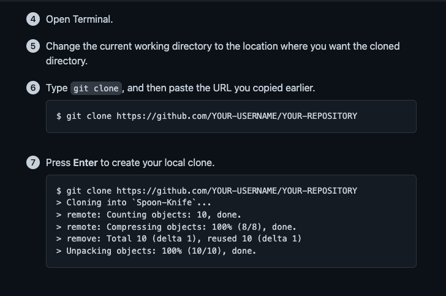

  
   

  <h3><b>My README Template</b></h3>

# 📗 Table of Contents

- [📖 About the Project](#about-project)
  - [🛠 Built With](#built-with)
    - [Tech Stack](#tech-stack)
  - [🚀 Live Demo](#live-demo)
- [💻 Getting Started](#getting-started)
  - [Setup](#setup)
  - [Prerequisites](#prerequisites)
  - [Install](#install)
  - [Usage](#usage)
  - [Run tests](#run-tests)
  - [Deployment](#triangular_flag_on_post-deployment)
- [👥 Authors](#authors)
- [🤝 Contributing](#contributing)
- [⭐️ Show your support](#support)
- [🙏 Acknowledgements](#acknowledgements)
- [📝 License](#license)

# 📖 [Microverse-Portfolio] 

**[Microverse-Portfolio]** this is a project designed by me using the provided figma template 5.

# Portfolio Mobile Version

> Description the project.
> For the first milestone in the process of creating my portfolio website, I:

> I set up a new repository and prepare it for development using best practices (e.g. linters).
> I build the first 2 sections of the mobile website using the template 5.

# 2nd  Milestone

Description the project.
> For the second milestone in the process of creating my portfolio website,

> I set up a new branch "mobile-section" and prepare it for development using best practices (e.g. linters).
> I build the second 2 sections (work-section & about-section) of the mobile website using the template 5.

# 3rd Milestone

Description of the project.

> for the third milestone in the process of creating my portfolio website,

> I set up a new branch "contact-section" and prepare it for development using best practices (e.g liners).
> I build the third 3 sections (contact-section and footer) of the mobile website using the template 5.

# 4th Milestone 
 
 Description of the Project

 > for the 4th milestone in the process of creating my portfolio website,

 > I set up a new branch "desktop-version" and prepare it for development using best practices (e.g linters).

 > build desktop version for the portfolio using the figma template 5.

# Animation and Transition

>  #Description

> Add Transition to the Nav-Links
> Collaborate With my Group Partner
> Add Animation to the Buttons.

# 5th Milestone

### Portfolio: application deploy

>. Description

For this milestone i make my website available online.

> deployment using github pages.

# Portfolio - mobile menu 

> . Description 

> . For this milestone i add mobile menu to the portfolio
> . use javaScript to tweak the mobile menu hamburger

## 🛠 Built With 
- HTML and CSS
- Webhint
- Stylelint
- eslint
- Github Pages

  
Client

  <ul>
    <li><a href="https://reactjs.org/">React.js</a></li>
  </ul>

  
Server

  <ul>
    <li><a href="https://expressjs.com/">Express.js</a></li>
  </ul>

Database

  <ul>
    <li><a href="https://www.postgresql.org/">PostgreSQL</a></li>
  </ul>

## 🚀 Live Demo 

- [Live Demo Link](https://solorics.github.io/Portfolio-Mobile-FIrst/)

(<a href="#readme-top">back to top</a>)

## 💻 Getting Started 

Cloning this project Git clone https://github.com/solorics/Portfolio-Mobile-First.git

To get a local copy up and running follow these simple example steps.

### Prerequisites

. A working browser application.
. VS code or anu other IDE
. NPM (Node Package Manager)

(<a href="#readme-top">back to top</a>)

### Setup

Clone this repository to your desired folder:

 
  
   

(<a href="#readme-top">back to top</a>)

### Install
### Usage
### Run tests

To run tests, run the following command:

. npm init -y
. npm install --save-dev hint@6.x

For validation detection to use Webhint Run -npx hint .

##INSTALLING AND TESTING STYLEHINT

. npm install --save-dev stylelint@13.x stylelint-scss@3.x stylelint-config-standard@21.x stylelint-csstree-validator@1.x
For validation detection to use Webhint Run

. npx stylelint "**/*.{css,scss}"

##INSTALLING AND TESTING ESLINT

1. RUN

. npm install --save-dev eslint@7.x eslint-config-airbnb-base@14.x eslint-plugin-import@2.x babel-eslint@10.x

. Copy .eslintrc.json to the root directory of your project.

. Do not make any changes in config files - they represent style guidelines that you share with your team - which is a group of all Microverse students.

. If you think that change is necessary - open a Pull Request in this repository and let your code reviewer know about it.
Run npx eslint . on the root of your directory of your project.

. Fix linter errors.

(<a href="#readme-top">back to top</a>)

### Deployment

You can deploy this project using:

> deployment using github pages.

(<a href="#readme-top">back to top</a>)

## 👥 Authors 

> Mention all of the collaborators of this project.

👤 **Solorics**

- GitHub: [@githubhandle](https://github.com/solorics)
- Twitter: [@twitterhandle](https://twitter.com/Solorics2)
- LinkedIn: [LinkedIn](https://www.linkedin.com/in/solomon-opeyemi-0427a6155/)
- Portfolio Project: [https://solorics.github.io/Portfolio-Mobile-FIrst/]

👤 **Leehany George**

- GitHub: [@githubhandle] (https://github.com/leehaney254)

(<a href="#readme-top">back to top</a>)

## 🤠Contributing 

Contributions, issues, and feature requests are welcome!

Feel free to check the [issues page](../../issues/).

(<a href="#readme-top">back to top</a>)

## ⭐️ Show your support 

> Write a message to encourage readers to support your project

If you like this project...

(<a href="#readme-top">back to top</a>)

## 🙠Acknowledgments 

> Give credit to everyone who inspired your codebase.
- Hat tip to anyone whose code was used
- Inspiration
- etc.

(<a href="#readme-top">back to top</a>)

(<a href="#readme-top">back to top</a>)

## 📠License 

This project is [MIT](./LICENSE) licensed.

_NOTE: we recommend using the [MIT license](https://choosealicense.com/licenses/mit/) - you can set it up quickly by [using templates available on GitHub](https://docs.github.com/en/communities/setting-up-your-project-for-healthy-contributions/adding-a-license-to-a-repository). You can also use [any other license](https://choosealicense.com/licenses/) if you wish._

(<a href="#readme-top">back to top</a>)

